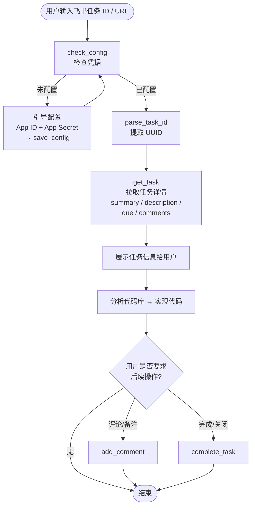
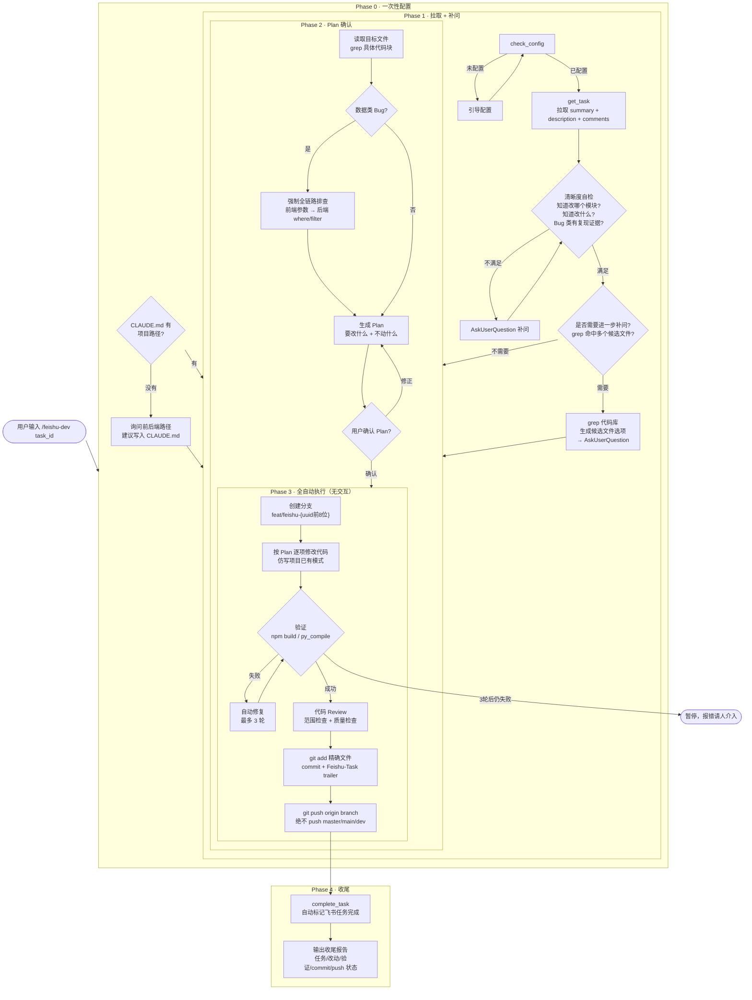
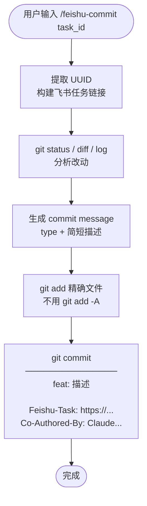

# feishu-tasks 插件功能流程图

## 总体架构

```
用户输入
  ├── /feishu-task  ──→ 拉取任务 + 实现代码（按需完成/评论）
  ├── /feishu-dev   ──→ 全自动开发流程（拉取→Plan→实现→验证→commit→push）
  └── /feishu-commit──→ 普通 commit + 自动注入飞书链接

共享底层：feishu_api.py（Python stdlib，零依赖）
```

---

## 一、feishu-task：任务处理



---

## 二、feishu-dev：全自动开发流程



---

## 三、feishu-commit：带链接提交



---

## 四、feishu_api.py：底层 API 层

| 命令 | 功能 |
|------|------|
| `check_config` | 检查 `~/.claude/plugins/cache/.../config.json` 是否存在 |
| `save_config <id> <secret>` | 保存凭据，清除 token 缓存 |
| `get_task <task_id>` | 获取 token（文件缓存，有效期内复用）→ 调飞书 API |
| `list_tasks [--completed]` | 列出待办或已完成任务 |
| `complete_task <task_id>` | PATCH `completed_at` 标记完成 |
| `add_comment <task_id> <text>` | POST 添加评论 |

**Token 缓存策略**：有效期内直接读文件，过期前 60s 自动刷新，避免频繁请求。

---

## 关键设计决策

| 设计点 | 说明 |
|--------|------|
| 人工介入只有 2 次 | feishu-dev 中：补问（~5s）+ Plan 确认（~30s） |
| 数据类 bug 强制全链路 | 不能只修前端，必须同时读后端接口代码 |
| commit 绝不 `git add -A` | 精确 add，避免误提交 `.env` 等文件 |
| 凭据与插件文件分离 | 存 `~/.claude/plugins/cache/`，更新插件不丢凭据 |
| 零依赖 | `feishu_api.py` 纯 stdlib，无需 pip install |
